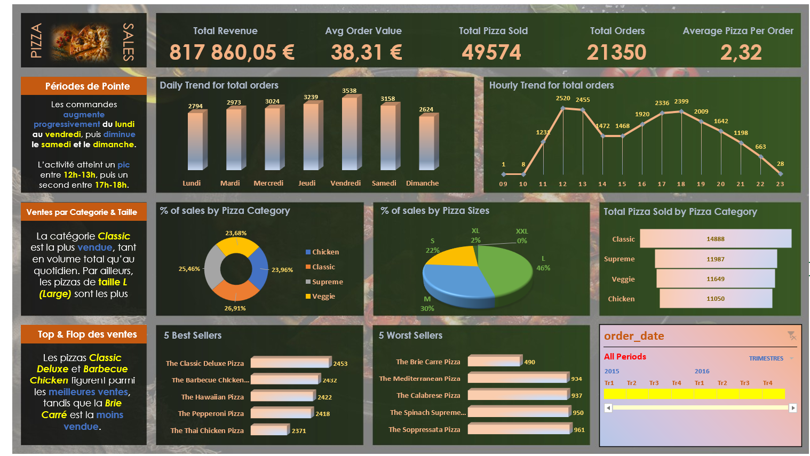

# 🍕 Pizza Sales Dashboard - Analyse Business Intelligence

**Tableau de bord analytique complet pour l'analyse des performances de ventes de pizzas**

---

## 📊 Vue d'ensemble du projet

Ce projet présente un **dashboard analytique interactif** développé pour analyser en profondeur les performances commerciales d'une entreprise de vente de pizzas. L'outil permet aux décideurs de visualiser instantanément les KPIs critiques et d'identifier les tendances pour optimiser la stratégie commerciale.

### 🎯 Objectifs stratégiques

- **Optimiser le chiffre d'affaires** en identifiant les produits et périodes les plus performants
- **Améliorer l'expérience client** grâce à l'analyse des tendances de commandes
- **Maximiser l'efficacité opérationnelle** via l'identification des heures de pointe
- **Guider les décisions stratégiques** concernant l'offre produit et le pricing

---

## 🔑 Indicateurs clés de performance (KPIs)

| Métrique | Valeur | Description |
|----------|--------|-------------|
| **Chiffre d'affaires total** | 817 860,05 € | Revenu total généré sur la période |
| **Valeur moyenne par commande** | 38,31 € | Panier moyen client |
| **Pizzas vendues** | 49 574 | Volume total de pizzas |
| **Nombre de commandes** | 21 350 | Transactions totales |
| **Pizzas par commande** | 2,32 | Quantité moyenne par transaction |

---

## 📈 Fonctionnalités analytiques

### 🗓️ Analyse temporelle
- **Tendances quotidiennes** : Identification des jours de forte affluence (vendredi : pic à 3 538 commandes)
- **Analyse horaire** : Visualisation des heures de pointe (12h-13h et 17h-18h)
- **Patterns hebdomadaires** : Progression progressive lundi-vendredi, diminution samedi-dimanche

### 🍕 Segmentation produit

#### Performance par catégorie
| Catégorie | Part de marché | Volume |
|-----------|---------------|---------|
| **Classic** | 26,91% | 14 888 pizzas |
| **Supreme** | 25,46% | 11 987 pizzas |
| **Veggie** | 23,68% | 11 649 pizzas |
| **Chicken** | 23,96% | 11 050 pizzas |

#### Distribution par taille
- **Large (L)** : 46% - Format le plus populaire
- **Medium (M)** : 30% - Deuxième choix
- **Small (S)** : 22% - Format économique
- **XL / XXL** : 2% - Formats premium

### 🏆 Top & Flop Performers

#### ⭐ Top 5 Best Sellers
1. **The Classic Deluxe Pizza** - 2 453 ventes
2. **The Barbecue Chicken Pizza** - 2 432 ventes
3. **The Hawaiian Pizza** - 2 422 ventes
4. **The Pepperoni Pizza** - 2 418 ventes
5. **The Thai Chicken Pizza** - 2 371 ventes

#### ⚠️ Top 5 Worst Sellers
1. **The Brie Carre Pizza** - 490 ventes
2. **The Mediterranean Pizza** - 934 ventes
3. **The Calabrese Pizza** - 937 ventes
4. **The Spinach Supreme Pizza** - 950 ventes
5. **The Soppressata Pizza** - 961 ventes

---

## 💡 Insights stratégiques

### 📌 Points clés identifiés

1. **Concentration des ventes sur Classic** : La catégorie Classic représente la plus forte demande, indiquant une préférence pour les recettes traditionnelles

2. **Opportunité taille L** : 46% des ventes en format Large suggère une opportunité de bundling ou de promotion sur ce format

3. **Optimisation du menu** : Les 5 pizzas les moins vendues représentent un potentiel de rationalisation du menu ou de campagnes marketing ciblées

4. **Gestion des ressources** : Les pics horaires identifiés (12h-13h, 17h-18h) permettent d'optimiser la planification du personnel

5. **Stratégie hebdomadaire** : L'augmentation progressive lundi-vendredi suggère des opportunités de promotions en début de semaine

### 🎯 Recommandations actionnables

- **Marketing** : Focus promotionnel sur les catégories Supreme et Veggie pour équilibrer le mix produit
- **Opérations** : Renforcement des équipes aux heures de pointe (12h-13h, 17h-18h)
- **Produit** : Révision ou repositionnement des 5 worst sellers (retravail recette ou communication)
- **Pricing** : Test de stratégies de prix différenciées pour augmenter le panier moyen au-delà de 38,31 €
- **Innovation** : Développement de nouveaux produits en format L basé sur la préférence client

---

## 🛠️ Technologies et compétences

### Outils utilisés
- **Microsoft Excel** : Développement du dashboard et modélisation des données
- **SQL** : Extraction et Agrégation des données
- **GitHub** : Gestion et présentation du projet

### Compétences démontrées
- ✅ **Analyse de données** : Exploration et transformation de datasets
- ✅ **Business Intelligence** : Conception de KPIs et métriques pertinentes
- ✅ **Data Visualization** : Design de dashboards ergonomiques
- ✅ **Analyse commerciale** : Interprétation des tendances et recommandations business
- ✅ **Storytelling de données** : Communication efficace des insights

---

## 🚀 Utilisation

### Prérequis
- Microsoft Excel 2016 ou supérieur
- Connaissances de base en analyse de données

## 🚀 Accès au dashboard
- Télécharger le repository
- Ouvrir le fichier Excel du dossier `excel/`

## 🔍 Cas d'usage

Ce dashboard peut être utilisé par :
- **Direction générale** : Suivi des performances globales
- **Équipe marketing** : Identification des produits à promouvoir
- **Responsables opérationnels** : Planification des ressources
- **Analystes business** : Deep-dive dans les tendances de ventes
- **Chefs de produit** : Optimisation du catalogue

---

## 🌟 Points forts du projet

1. **Approche data-driven** : Décisions basées sur des données factuelles, pas des intuitions
2. **Visualisations impactantes** : Graphiques clairs et immédiatement actionnables
3. **KPIs pertinents** : Métriques alignées avec les objectifs business
4. **Scalabilité** : Dashboard facilement adaptable à d'autres produits/secteurs
5. **Documentation complète** : README détaillé facilitant la compréhension et la réutilisation

---

## 📚 Apprentissages et défis relevés

### Compétences développées
- Conception de dashboards orientés utilisateur
- Communication visuelle de données quantitatives

---

## 👤 Auteur

**Sam Loik CODO TOAFODE**
- LinkedIn: [Votre profil LinkedIn](https://www.linkedin.com/in/samloikcodotoafode)
- Portfolio: [Votre site web](https://sam-toafode.wuaze.com)
- Email: toafodesam8@gmail.com

---

## 📄 Licence

Ce projet est sous licence MIT - voir le fichier [LICENSE](LICENSE) pour plus de détails.

---

## 🙏 Remerciements

- Données inspirées de cas réels de l'industrie de la restauration
- Design influencé par les meilleures pratiques en Business Intelligence
- Communauté data analytics pour le partage de connaissances

---

**⭐ Si ce projet vous a été utile, n'hésitez pas à lui donner une étoile ! ⭐**

---

## 📞 Contact

Pour toute question ou suggestion d'amélioration, n'hésitez pas à :
- Ouvrir une Issue
- Proposer une Pull Request
- Me contacter directement via [LinkedIn](https://www.linkedin.com/in/samloikcodotoafode)

---
